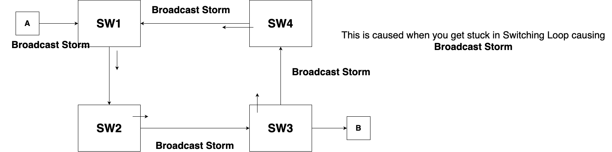

# Private and Public Infrastructure

So far, we know how to deal with IP addresses and subnets, how to calculate subnet masks, and how to create subnets along with determining the number of hosts that can exist within a subnet.

## Private and Public IP Addresses

There are two types of IP addresses: **private** and **public**.

-   **Private IPs** are used within private organizations. Since private IPs can be the same as those on the internet, they cannot be used for communication over the internet.
    
-   **Public IPs** are unique and are assigned by appropriate authorities such as **RIPE, ARIN, and AFRINIC**, or **Local Internet Registries (LIRs)**. These IPs allow devices to communicate over the internet.
    

### Network Address Translation (NAT) and Proxy Servers

-   **NAT (Network Address Translation)** is a technology used by routers to translate private IP addresses into public IP addresses, enabling communication with the internet.
    
-   **Proxy servers** act as intermediaries between private networks and the internet. The router assigns a dummy IP and sends requests on behalf of the internal network.
    
-   Both **NAT** and **Proxy** are essential for enabling private IP communication over the internet.
    

### APIPA (Automatic Private IP Addressing)

-   APIPA is a type of IP address that systems assign to themselves when a DHCP server is unavailable. The system assigns itself an IP in the **169.254.0.0/16** range, allowing local communication within the subnet.
    

### Reserved IP Address Ranges

-   **Private Address Series:**
    
    -   `10.0.0.0/8` (10.0.0.0 - 10.255.255.255)
        
    -   `172.16.0.0/12` (172.16.0.0 - 172.31.255.255)
        
    -   `192.168.0.0/16` (192.168.0.0 - 192.168.255.255)
        
-   **Multicast Address Range:**  `224.0.0.0 - 239.255.255.255`
    
-   **APIPA (Self-Assigned IP Range):**  `169.254.0.0/16`
    
-   **Loopback Addresses:**  `127.0.0.0/8`
    

## Spanning Tree Protocol (STP)

### Understanding Switching Loops

When multiple switches are connected in a circular fashion, a broadcast storm can occur. A broadcast sent by one switch can get forwarded infinitely, leading to excessive network congestion.

-   **Switches are not intelligent** enough to detect and prevent broadcast loops by default.
    
-   **Spanning Tree Protocol (STP)** prevents switching loops by disabling redundant links in the network.
    
-   Routers help separate **collision domains**, ensuring more efficient network segmentation.
    

### What is a Collision Domain?

A **collision domain** is an area in a network where multiple frames can collide. If two devices transmit data at the same time within the same domain, a collision occurs, leading to retransmissions and network slowdowns.

## Network Cabling

### Ethernet Cables

-   **Straight-through cables** are standard Ethernet cables where both ends have the same wiring order. These are used to connect different types of devices like routers and switches.
    
-   **Crossover cables** are used to connect similar devices, such as two switches or two computers. These cables swap the transmit and receive wires to establish communication.
    

### CSU/DSU (Channel Service Unit/Data Service Unit)

-   **CSU/DSU** is used to connect routers to leased lines (e.g., **T1** and **T3** lines).
    
-   The **CSU** acts as a **bridge**, ensuring a connection between the router and the telecom provider.
    
-   The **DSU** converts the router's digital signals into a format that leased lines can understand.
    

### DTE/DCE Communication

Before understanding **DTE/DCE (Data Terminal Equipment/Data Communication Equipment)**, we need to differentiate between **synchronous** and **asynchronous** communication.

-   **Asynchronous Transmission:** Sends data one bit at a time, using **start** and **stop** bits to indicate data boundaries.
    
-   **Synchronous Transmission:** Uses a shared **clock signal**, eliminating the need for start and stop bits, making data transfer much faster.
    
-   **DCE (Data Communication Equipment)** generates clock signals, while **DTE (Data Terminal Equipment)** receives and interprets them.
    

## Network Devices

### Hubs and Repeaters

-   **Hub:** A network device that simply broadcasts data to all devices in a network.
    
-   **Repeater:** Amplifies weak signals to extend network communication distances.
    
-   Unlike hubs, repeaters **purify** signals by removing noise before amplification.
    

## Routers and Routing Protocols

Routers connect different networks and use **routing tables** to determine the best path for data packets.

-   Example: If **PC1 (172.16.10.2/24)** in **Pune** wants to communicate with **PC2 (172.16.30.2/24)** in **Delhi**, it first sends data to its **default gateway (router)**.
    
-   Routers have multiple interfaces, each connected to a different network. The router’s **routing table** contains information about networks and paths.
    

### Routing Protocols

-   **RIP (Routing Information Protocol)**
    
-   **OSPF (Open Shortest Path First)**
    
-   **EIGRP (Enhanced Interior Gateway Routing Protocol)**
    

## Transport Layer Functionality

The **Transport Layer (Layer 4 of the OSI model)** ensures reliable data transfer. It includes:

-   **Acknowledgment (ACK) and Negative Acknowledgment (NACK)** mechanisms.
    
-   **Segmentation**: Breaking data into smaller units with sequence numbers.
    
-   **Flow Control**: Managing resource availability using **window size**.
    
-   **Retransmission**: Resending lost data segments.
    

|UDP         |TCP       |
|------------|----------|
|It is not reliable as TCP ensure error correction and detection| It is reliable as it uses three-way handshaking|
|It is fast | It is slow|
|UDP doesn't have any flow control| TCP has a flow control and check if reciever is ready to recieve data|

*Why UDP is so fast?* UDP segment carry more data than the TCP, and TCP is reliable and flow control and is flexible. TCP is also got a bigger level.

Now calculate for the following considering **W.X.Y.0/29**:

- FIRST HOST ON 5TH SUBNET
- LAST HOST ON 10TH SUBNET
- BR ID 12TH SUB
- LAST HOST ON 15TH SUBNET
- LAST HOST ON 20TH SUB
- LAST HOST ON LAST SUB

*How we solve this?* Refer to [subnet calculation](../More Basics/subnet-calculation.md) to learn more, however if you see, every octet varies from 0-255. Thus, this means that every bit that subnet occupies, say **/25, /26, /27, /28, /29, /30, /31, /32**, has fixed amount of subnets and host that lies within each subnet. Each subnet will have a certain reach, like **/24** will have one subnet **W.X.Y.128/25**, and it will have about 2⁷-2=**126** hosts.

| `/25`  | `/26`  | `/27`  | `/28`  | `/29`  | `/30`  | `/31`  | `/32`  |
|--------|--------|--------|--------|--------|--------|--------|--------|
|  128   |  192   |  224   |  240   |  248   |  252   |  254   |  255   |
|`.128`  | `.64`  | `.32`  | `.16`  | `.8`   | `.4`   |  `.2`  | `.1`   |

The above tables tells how each subnet, say **/29** starts with `.8` and goes in iteration (or multiple of 64), so the first host 5th subnet of **W.X.Y.41** because the 5th subnet would be **W.X.Y.40/29**. Similarly, you can solve others.

So let's solving **W.X.Y.0/29**.

We know the subnet **/29** means that the first **five** bits are occupied, so the first **subnet** will start from **W.X.Y.8/29**, then **W.X.Y.16/29**, then **W.X.Y.24/29**, and so on. 

**FIRST HOST ON 5TH SUBNET**
- W.X.Y.41/29

**LAST HOST ON 10TH SUBNET**
- W.X.Y.86/29

**BR ID 12TH SUB**
- W.X.Y.103/29

**LAST HOST ON 15TH SUBNET**
- W.X.Y.126/29

**LAST HOST ON 20TH SUB**
- W.X.Y.166/29

**LAST HOST ON LAST SUB**
- W.X.Y.246/29
